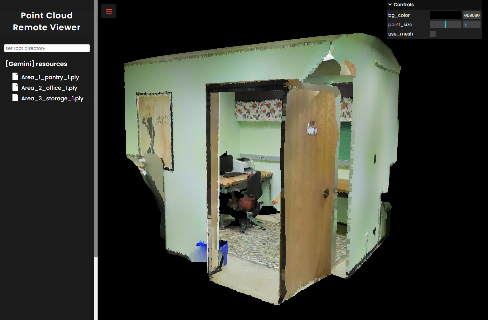

# Remote Viewer

- View 3D model on the remote server.
- Useful when you are working on a remote server and need to view 3D models.

## About this project

### Built With

- [threejs](https://threejs.org/)
- [flask](https://flask.palletsprojects.com/en/2.0.x/)

## Getting Started

### Prerequisites

- This code has been tested with python 3.7, node v14 on Ubuntu 18.04.

### Installation

1. Clone the repository:

```bash
git clone https://github.com/crayonsea/remote_viewer.git
```

2. Setup python environment:

```bash
pip install -r requirement.txt
```

3. Build frontend:

```bash
cd static
npm install
npm run build
```

### Run Code

```bash
cd ..
python pc_viewer.py
```

## Usage

- Set remote working directory on the input box.
- Open directory and point cloud files in the filetree.
- Adjust display properties in the control bar.



## Features

- view remote server file list
- visualize 3d data on a remote server in a local browser
- currently support data type:
    - point cloud: *.ply
